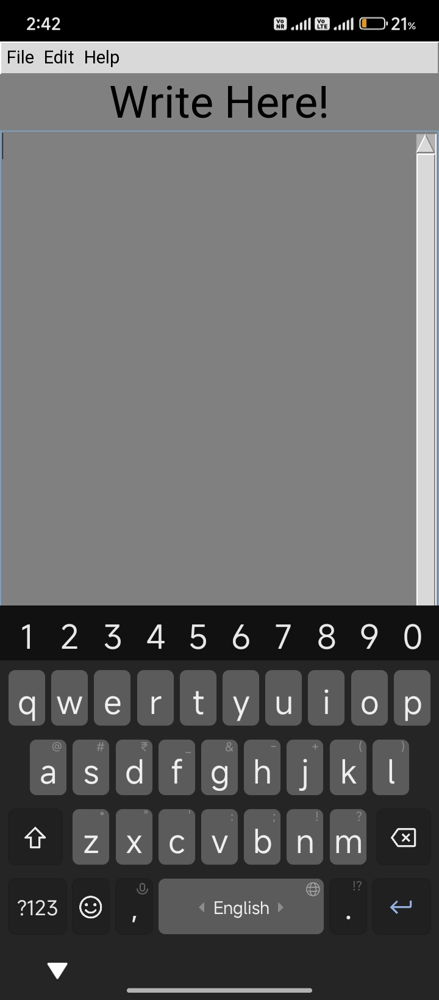

---

# 📒 GUI Notepad

A simple text editor built using Python and Tkinter, inspired by classic notepad applications.

---

## 📚 Table of Contents
- [Features](#-features)
- [Screenshot](#-screenshot)
- [Tech Stack](#-tech-stack)
- [How to Run](#-how-to-run)
- [Folder Structure](#-folder-structure)
- [License](#-license)
- [Author](#-author)

---

## 🚀 Features
- Create, Open, Save text files
- Scrollbar for large files
- Light, distraction-free UI
- File menu with basic shortcuts

---

## 🖼️ Screenshot



---

## ⚙️ Tech Stack
- Python 3
- Tkinter

---

## ▶️ How to Run

```bash
python notepad.py
```

---

## 📂 Folder Structure

gui-notepad/
├── notepad.py
├── README.md
├── LICENSE
├── screenshot.jpg

---

## 📄 License

Licensed under the MIT License.  
See [LICENSE](LICENSE) file for full text.

---

## 🙋‍♂️ Author

**Raunak Raj**  
- Class 10 Student | From India 🇮🇳  
- Aspiring Freelancer | Web Developer | Python Programmer  
- [Portfolio Website](https://raunak-raj-2025.github.io)
